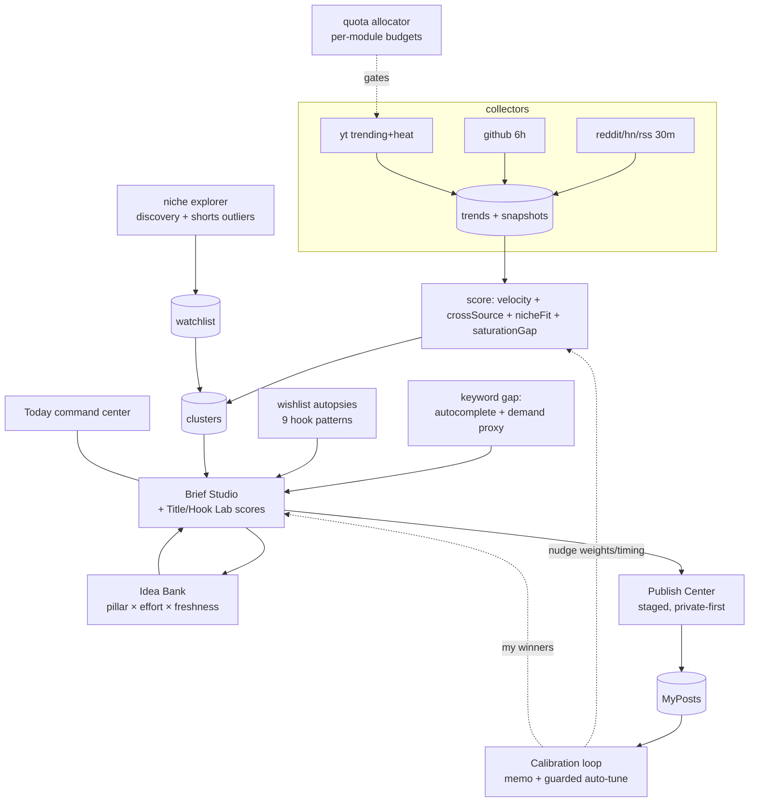
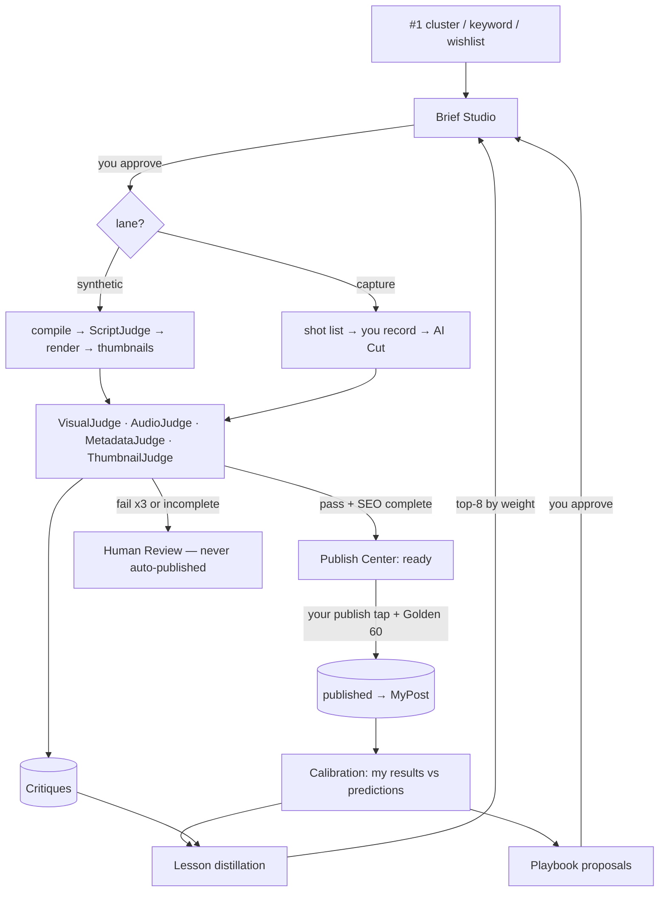

# Content Factory

Code-first automated video studio. One pipeline for every video:

```
Trend Radar → Script Studio → Voice (your clone) → Render Farm → Review Gate → Publisher → Analytics
   hourly        Claude         ElevenLabs        Remotion/Manim   HUMAN, 15-30m   YT/TT/IG     daily
```

Full master plan: https://claude.ai/code/artifact/eff26ba0-ee88-42f3-a7f5-b7f6d5d2f5b0

## Quickstart

```bash
cp .env.example .env      # fill keys as phases come online
npm run doctor            # verify the toolchain — zero install needed
npm install               # remotion + react + shiki (P1+)

# render an episode (16:9 + 9:16) from a script:
node packages/cli/bin/factory.js render renderers/code-report/examples/factory-online.json

# the daily loop (CLI):
node packages/cli/bin/factory.js radar          # scan + score trending topics
node packages/cli/bin/factory.js script <ID>    # draft a script from a trend (or a "topic")
node packages/cli/bin/factory.js render data/scripts/<id>.json

# or use the portal — everything above in one UI:
npm run dev --prefix apps/mission-control       # -> http://localhost:4600

# keep it fresh automatically (collect 30m / youtube 60m / deep 6h / digest 08:00 IST):
node packages/cli/bin/factory.js worker

# math shorts (Manim) + clip mining:
node packages/cli/bin/factory.js math gauss-sum --demo    # bundled demo, no key
node packages/cli/bin/factory.js math "why 0! = 1"        # LLM writes the scene
node packages/cli/bin/factory.js shorts <rendered-id>     # cut 1-3 clips from an episode

# AI Cut filmed footage — 100% local:
#   silence + filler-word ("um"/"uh") jump cuts, LLM backtracking of
#   self-corrections, noise cancellation, loudnorm, grade/vignette/fades,
#   punch-ins, karaoke captions per aspect, personal dictionary
node packages/cli/bin/factory.js edit "D:\footage\my-tutorial.mp4"
#   opt-outs: --no-punch --no-captions --no-denoise --no-fillers --no-backtrack
#   jargon spelling: copy data/dictionary.example.json -> data/dictionary.json
```

Math shorts need Manim in the project venv (kept off C: on purpose):
`D:\python312\python.exe -m venv .venv` then `.venv\Scripts\pip install manim`.
No LaTeX required — scenes are linted to use Text/shapes only.

## Publishing (safe by default)

```bash
node packages/cli/bin/factory.js auth-youtube      # one-time: you approve in browser
node packages/cli/bin/factory.js publish <id>      # compliance check + DRY RUN (nothing uploaded)
node packages/cli/bin/factory.js publish <id> --go # real upload, PRIVATE by default
node packages/cli/bin/factory.js publish <id> --go --public   # explicit, goes live
node packages/cli/bin/factory.js publish <id> --go --at "2026-07-13T15:00"  # scheduled
node packages/cli/bin/factory.js analytics         # pull stats -> category weights steer the radar
```

Publishing is gated: a compliance lint (render present, human review logged,
synthetic-media disclosure, no verbatim narration, ≤2/day/platform) must pass;
uploads are **private** unless you explicitly pass `--public`/`--unlisted`;
`--go` is required for any real upload (default is a dry run). The synthetic-
content disclosure is set programmatically on every upload.

## Mission Control (the portal)

Trends (scan/filter/draft) → Scripts (scene-by-scene editor, title/hook
options) → Math (Manim shorts + demos) → Approve & render (live job log) →
Renders (in-browser preview + “Cut shorts”) → Settings (radar categories +
provider status).

## Content OS (Phase 1 + 2 — Intelligence, Parity & Publishing, v2.0)

Trend intelligence + competitor parity + staged publishing + a
self-calibration loop, layered on the factory. Collect → score → autopsy →
brief → stage → publish (you tap) → measure MY results → self-tune.



**Module map — what each replaces (and does better):**

| Content OS module | Replaces | Edge |
|---|---|---|
| Watchlist + Shorts Outliers + Title Lab | 1of10 / TubeLab | shorts vs long medians split; your own winners fed back |
| Hook Lab + Keyword Gap | OutlierKit | 9-pattern scoring; demand as honest **proxy**, no fake volume |
| Idea Bank + Series Planner | Spotter | ranking tuned to YOUR pillar history + available hours |
| Wishlist manual mode | Octupie | IG/FB metrics by hand — never scrapes Meta |
| Saturation Gap + Calibration | *(nothing sells this)* | demand-vs-supply gap; predictions scored against your real results |

- **Setup:** `npm install` once; everything runs keyless with visible
  degradation (heuristic scoring, template briefs). Full power needs two
  free-tier keys in `.env`: `YOUTUBE_API_KEY` (Google Cloud → YouTube Data
  API v3) and one LLM key (`ANTHROPIC_API_KEY` / `OPENROUTER_API_KEY` /
  `OLLAMA_MODEL`). Publishing adds a one-time `factory auth-youtube` OAuth.
- **Quota safety:** every YouTube call passes one 30-min-cached, 50-id-
  batched gateway that logs true unit costs and consults a **per-module
  daily allocator** (watchlist 800, trending 200, niche-heat 600, keyword-
  gap 2200, discovery 500, wishlist-tracking 300, my-channel 100, reserve
  1000; uploads draw reserve at 1600 each). Exhausted modules skip with a
  warning — never a silent failure. `YT_DAILY_UNIT_CAP` (8000) is the
  global backstop.
- **Publishing:** staged is the permanent default — uploads go
  private/unlisted with metadata + AI disclosure set; you flip them live.
  Auto mode needs `PUBLISH_MODE=auto` **and** `YOUTUBE_APP_VERIFIED=true`
  (+ `META_APP_REVIEWED=true` for IG/FB), checked at runtime.
- **Commands:** `factory radar` · `factory yt trending|heat|watch|discover|
  map|outliers` · `factory wishlist` · `factory brief` · `factory lab` ·
  `factory keywords` · `factory ideabank` · `factory center` ·
  `factory calibrate seed|memo|tune|scorecard` · `factory worker`
- **Portal (:4600):** Today · Trends · YouTube · Wishlist · Briefs ·
  Publish · Lab · Keywords · Ideas · Calibration · Settings.

### Ops runbook

- **Keep it fresh:** run `factory worker` in a terminal you leave open
  (collect 30m, YouTube+tracking 60m, deep refresh 6h, digest + memo +
  auto-tune Mon 08:00 IST). Do NOT run two workers — no singleton lock yet.
- **Backup:** Settings → Export backup (one JSON of all `data/os/` +
  config). `data/` is gitignored; back it up before big changes.
- **Failure states:** missing keys → clear "add key" notices, heuristics
  keep running. Module budget exhausted → that module skips with a
  warning, others keep going. A collector breaking → its row shows the
  error, the rest of the run proceeds.
- **Approval queues (start now, run in parallel):** YouTube API app
  verification + Meta app review. Auto mode flips on when they clear —
  zero code changes.

## Phase 3 — Production + Self-Improvement (v3.0, complete)

The whole machine: an idea becomes a publish-ready video, judged at every
hop, and the system learns from the results.



- **Two lanes:** synthetic runs approve→ready zero-touch; capture assists
  you (shot list → record → auto-edit). Production kanban tracks every
  brief; stuck items (>24h, >6h trend) raise alerts.
- **Judge network (P18):** 5 judges gate each hop; fails regenerate (max 3,
  $0.50 cap) then escalate. Nothing escalated ever auto-publishes.
- **Self-improvement (P19):** judge critiques + my results distill into
  cited lessons that inject into generation; prompt versions change only
  with my approval.
- **Playbooks (P22):** per-platform rules re-derived from observed
  outcomes; algorithm chatter is quarantined, never auto-applied.
- **Proven (P23 dry run):** #1 cluster → ready in **1.9 min at $0.00**
  keyless (targets <45 min, <$2). Corrupt renders and sabotaged scripts
  are caught and escalated; nothing half-publishes.

### The three platform walls (honest limits)

1. **Meta app review** — IG/FB Graph publishing is gated off until
   approved; manual-metrics + copy-paste until then.
2. **YouTube API verification** — auto-publish stays off until Google's
   audit clears; staged private/unlisted drafts are the surviving default.
3. **Instagram's closed data** — no IG/FB metric scraping, ever;
   manual-entry only. Real CTR/impressions aren't exposed anywhere, so we
   never fake them.

### Human touchpoints (load-bearing, by design)

Brief approval (originality shield) · capture-lane recording · the publish
tap + **Golden 60** (first-hour comment replies — a ranking input no API
fakes) · the weekly review of memo + lessons + playbook proposals. These
are the quality moat, not friction to automate away.

## AI providers (pick one in .env)

| Provider | Cost | Quality | Setup |
|---|---|---|---|
| Anthropic | ~$10-20/mo | best writing | `ANTHROPIC_API_KEY` |
| OpenRouter | cheap → **free** (`:free` models) | varies by model | `OPENROUTER_API_KEY` |
| Ollama | **$0, runs locally** | depends on your hardware | `OLLAMA_MODEL` after `ollama pull` |

No key at all still works: heuristic trend scoring + fillable script templates.

Without ElevenLabs keys in `.env`, voice falls back to Windows TTS with
estimated word timings — fine for previews. Add `ELEVENLABS_API_KEY` +
`ELEVENLABS_VOICE_ID` and the same command uses your cloned voice with
exact word-level sync. Voice is cached per scene, so unchanged scenes
never re-bill the API.

`factory doctor` is the health check for the whole machine. It knows which
phase each dependency belongs to, so it tells you what's blocking *now* vs.
what can wait.

## Structure

```
packages/cli/       the `factory` command (doctor; later: render, radar, script, publish)
packages/shared/    env loading, repo paths, config
renderers/          P1: code-report (Remotion) · P4: math (Manim), shorts
apps/               P3: Mission Control dashboard (Next.js)
assets/brand/       palette, logo, intro sting, licensed SFX/music only
data/               (gitignored) SQLite: trends, jobs, analytics
renders/            (gitignored) finished MP4s
```

## Phase roadmap

| Phase | Deliverable | Status |
|-------|-------------|--------|
| P0 | Monorepo + `factory doctor` | **done** |
| P1 | Code Report renderer — script.json → MP4 (16:9 + 9:16) | **done** |
| P2 | Trend Radar + Script Studio (publishing starts) | **done** |
| P3 | Mission Control dashboard (localhost:4600) | **done** |
| P4 | Math engine (Manim) + Shorts factory | **done** |
| P5 | Publisher (YouTube) + compliance gate + analytics loop | **done** |
| P6 | Auto-Editor for filmed footage (separate makeup channel) | **done** |

## P0 homework (human tasks — nothing here can be automated)

1. **Voice clone** — record ~30 min of clean speech (quiet room, consistent
   mic distance, natural pace). Create an ElevenLabs professional voice
   clone → paste `ELEVENLABS_API_KEY` + `ELEVENLABS_VOICE_ID` into `.env`.
2. **YouTube API** — Google Cloud Console → new project → enable
   *YouTube Data API v3* → OAuth client (Desktop) → `YT_CLIENT_ID` +
   `YT_CLIENT_SECRET` into `.env`. (Refresh token is generated in P5.)
3. **Anthropic key** — console.anthropic.com → `ANTHROPIC_API_KEY`.
4. **Brand** — channel name + handle, 2–3 brand colors, pick an intro-sting
   concept (rendered later with the portfolio repo's Three.js render-engine).

## Rules the factory enforces (non-negotiable)

- Every video passes the **Review Gate** — a human edit + approval click.
- Own-voice clone only. No stock AI voices.
- Disclosure flags set programmatically wherever synthetic media is present.
- No verbatim article narration; no copyrighted meme clips.
- Per-platform native renders; max 2 uploads/day/platform.
